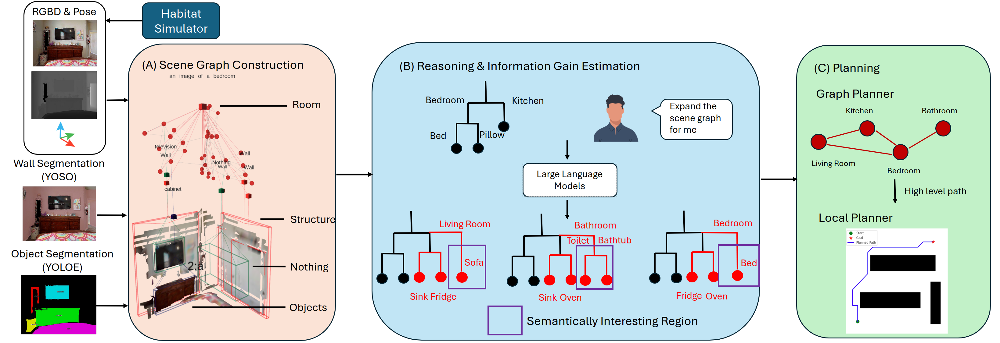

# Active Semantic Perception ([Paper])
Authors: Huayi Tang, Pratik Chaudhari

## Abstract
We develop an approach for active semantic perception which refers to using the semantics of the scene for tasks such as exploration.
We build a compact, hierarchical multi-layer scene graph that can represent large, complex indoor environments at various levels of abstraction, e.g., nodes corresponding to rooms, objects, walls, windows etc. as well as fine-grained details of their geometry.
We develop a procedure based on large language models (LLMs) to sample plausible scene graphs of unobserved regions that are consistent with partial observations of the scene.
These samples are used to compute an information gain of a potential waypoint for sophisticated spatial reasoning, e.g., the two doors in the living room can lead to either a kitchen or a bedroom.
We evaluate this approach in complex, realistic 3D indoor environments in simulation.
We show using qualitative and quantitative experiments that our approach can pin down the semantics of the environment quicker and more accurately than baseline approaches.




## Setup
### Install Pangolin
```
git clone --branch v0.8 --depth 1 https://github.com/stevenlovegrove/Pangolin.git

# Install using CMake
cd Pangolin
mkdir build && cd build
cmake ..
make -j
sudo make install
```
### Installation
```
mkdir -p ~/catkin_ws/src
cd ~/catkin_ws
catkin init
catkin config -DCMAKE_BUILD_TYPE=Release -DSEMANTIC_INFERENCE_USE_TRT=OFF
catkin config --skiplist khronos_eval
cd src
git clone --recursive https://github.com/bearyi26/active_semantic_perception
vcs import ./active_semantic_perception/mapping < active_semantic_perception/install/active_semantic_perception.rosinstall
rosdep install --from-paths . --ignore-src -r -y
cd ..
catkin build
```
### Setting up Python environments
We test our code on python 3.9.
```
python3 -m virtualenv --system-site-packages -p /usr/bin/python3 ~/environments/semantic_perception
source ~/environments/semantic_perception/bin/activate
pip install ~/catkin_ws/src/active_semantic_perception/mapping/semantic_inference/semantic_inference[openset]
pip install -r ~/catkin_ws/src/active_semantic_perception/mapping/scene_segment_ros/src/requirements.txt
pip install -e ~/catkin_ws/src/active_semantic_perception/mapping/spark_dsg
```
### Setting up Habitat environments
```
WITH_BULLET=1 WITH_CUDA=1 HEADLESS=0 CMAKE_ARGS="-DCMAKE_POLICY_VERSION_MINIMUM=3.5" pip install 'git+https://github.com/facebookresearch/habitat-sim.git@stable' -v
```
### Download weight
```
wget https://github.com/hujiecpp/YOSO/releases/download/v0.1/yoso_res50_coco.pth -O ~/catkin_ws/src/active_semantic_perception/mapping/scene_segment_ros/include/yoso_res50_coco.pth
```
### Install PyKDL
```
git clone --recursive https://github.com/orocos/orocos_kinematics_dynamics
git checkout 1.5.2
cd orocos_kdl && mkdir build && cd build
cmake .. && make && sudo make install
cd ../python_orocos_kdl
cmake .. -DPYTHON_EXECUTABLE=$(which python3) \
         -DPYTHON_INSTALL_DIR=$(python3 -c "import site; print(site.getsitepackages()[0])")
make && sudo make install
```

### Run pipeline
Before running the pipeline, perform the following check:
(1) Change the path of object_tasks, place_tasks and scene number in realsense.launch
(2) Change the path in pipeline_config.yaml
(3) Acquire your own GEMINI_API_KEY
```
echo 'export GOOGLE_API_KEY="your_actual_api_key_here"' >> ~/.bashrc && source ~/.bashrc
roslaunch clio_ros realsense.launch
cd src/active_semantic_perception/exploration/scripts
python exploration_pipeline.py
```

## Citation
```

```