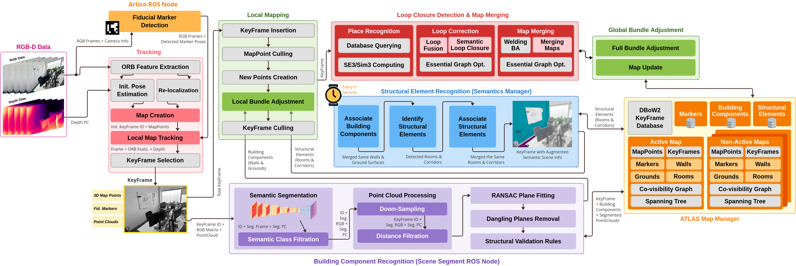

# Visual S-Graphs (vS-Graphs)


<!-- Badges -->

[](https://arxiv.org/abs/2503.01783)
[](https://www.gnu.org/licenses/gpl-3.0)

**vS-Graphs** is inspired by [LiDAR S-Graphs](https://github.com/snt-arg/lidar_situational_graphs) and extends [ORB-SLAM 3.0](https://github.com/UZ-SLAMLab/ORB_SLAM3) by integrating **optimizable 3D scene graphs**, enhancing mapping and localization accuracy through scene understanding. It improves scene representation with building components (_i.e.,_ wall and ground surfaces) and infering structural elements (_i.e.,_ rooms and corridors), making SLAM more robust and efficient.

## 🧠 vS-Graphs Architecture

Below diagram shows the detailed architecture of the **vS-Graphs** framework, highlighting the key threads and their interactions. Modules with a light gray background are inherited directly from the baseline (_ORB-SLAM 3.0_), while the remaining components are newly added or modified components.



## ⚙️ Prerequisites and Installation

For system requirements, dependencies, and setup instructions, refer to the [Installation Guide](/doc/INSTALLATION.md).

## 🔨 Configurations

You can read about the SLAM-related configuration parameters (independent of the `ROS` wrapper) in [the config folder](/config/README.md). These configurations can be modified in the [system_params.yaml](/config/system_params.yaml) file. For more information on ROS-related configurations and usage, see the [ROS parameter documentation](/doc/ROS.md) page.

## 🚀 Getting Started

Once you have installed the required dependencies and configured the parameters, you are ready to run **vS-Graphs**! Follow the steps below to get started:

1. Start a core node using `roscore`
2. Source vS-Graphs and run it by `roslaunch vs_graphs vsgraphs_rgbd.launch [2>/dev/null]`. It will automatically run the vS-Graphs core and the semantic segmentation module for **building component** (walls and ground surfaces) recognition.
3. (Optional) If you intend to detect **structural elements** (rooms and corridors) too, run the cluster-based solution using `roslaunch voxblox_skeleton skeletonize_map_vsgraphs.launch 2>/dev/null`.

   - In this case, you need to source `voxblox` with a `--extend` command, and then launch the framework:

   ```bash
   source /opt/ros/noetic/setup.bash &&
   source ~/[VSGRAPHS_PATH]/devel/setup.bash &&
   source ~/[VOXBLOX_PATH]/devel/setup.bash --extend &&
   roslaunch vs_graphs vsgraphs_rgbd.launch
   ```

4. (Optional) If you have a database of ArUco markers representing room/corridor labels, do not forget to run `aruco_ros` using `roslaunch aruco_ros marker_publisher.launch`.
5. Now, play a recorded `rosbag` file by running `rosbag play [sample].bag --clock`.

✨ For a complete list of configurable launch arguments, check the [Launch Parameters](/launch/README.md).

✨ For detailed description on how to use a RealSense D400 series camera for live feed and data collection, check [this page](/doc/RealSense/README.md).

> 🛎️ Note: The current version of vS-Graphs supports **ROS Noetic** and is primarily tested on Ubuntu 20.04.

## 🐋 Docker

For a fully reproducible and environment-independent setup, check the [Docker](/docker) section.

## 📏 Benchmarking

To evaluate vS-Graphs against other visual SLAM frameworks, read the [evaluation and benchmarking documentation](/evaluation/README.md).

## 📚 Citation

```bibtex
@article{tourani2025vsgraphs,
  title={vS-Graphs: Integrating Visual SLAM and Situational Graphs through Multi-level Scene Understanding},
  author={Tourani, Ali and Ejaz, Saad and Bavle, Hriday and Morilla-Cabello, David and Sanchez-Lopez, Jose Luis and Voos, Holger},
  journal={arXiv preprint arXiv:2503.01783},
  year={2025},
  doi={https://doi.org/10.48550/arXiv.2503.01783}
}
```

## 📎 Related Repositories

- 🔧 [LiDAR S-Graphs](https://github.com/snt-arg/lidar_situational_graphs)
- 🎞️ Scene Segmentor ([ROS1](https://github.com/snt-arg/scene_segment_ros))

## 🔑 License

This project is licensed under the GPL-3.0 license - see the [LICENSE](/LICENSE) for more details.
